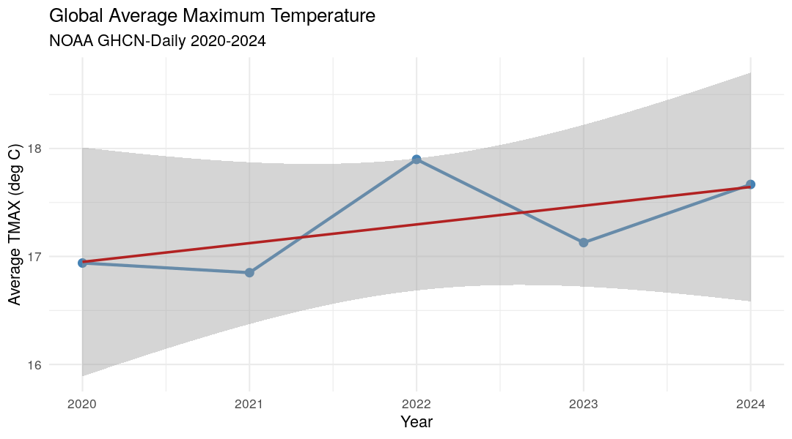
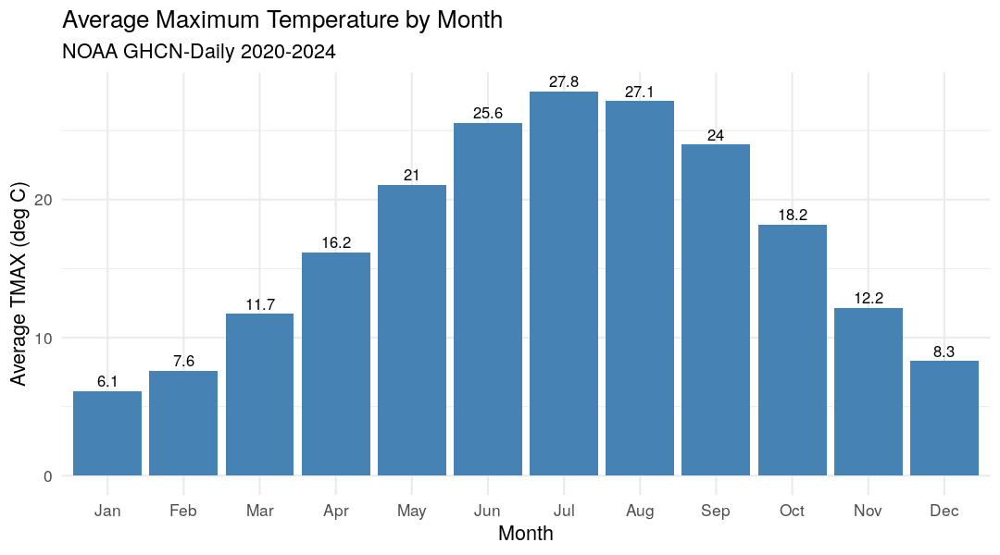
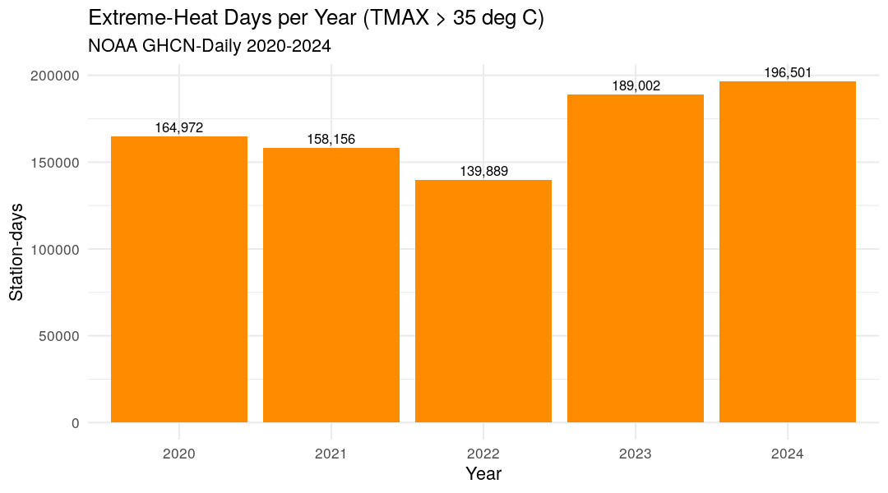

# NOAA GHCN-Daily Big-Data Analysis on a Distributed Spark + Hadoop Cluster

**Course:** Büyük Veri İşleme Teknikleri ve Uygulamaları
**Prepared by:** Abdullahi Mohamed Abdullah
**Student No:** 2528190501
**Course Instructor:** Assist. Prof. Dr. Ömer Faruk Acar

---

## Abstract

This project demonstrates a complete big-data processing pipeline for real-world
climate data. Five years (2020–2024) of the **NOAA Global Historical Climatology
Network — Daily (GHCN-Daily)** dataset — roughly **150 million weather
observations** — were ingested into a distributed **Apache Hadoop / Apache
Spark / Apache Hive** cluster running on Docker, persisted as Parquet on HDFS,
and analysed interactively from **RStudio** using the `sparklyr` package. The
pipeline produces three analyses: an annual temperature trend, a seasonal
cycle, and an extreme-heat-day count.

## 1. Introduction

Climate data is a classic big-data problem: NOAA's GHCN-Daily archive contains
billions of daily observations from over 100 000 stations worldwide. Even a
single year exceeds 30 million rows, far beyond the working set of a normal
desktop tool. This project shows how a small distributed cluster — built with
free, open-source components and orchestrated by Docker Compose — can ingest
and query that data efficiently on a single workstation.

**Project objectives**

1. Build a fully distributed cluster (HDFS, Spark, Hive, RStudio) using nine
   Docker containers.
2. Ingest a real, publicly available dataset of at least 10 million rows.
3. Convert raw CSV records to a columnar storage format (Parquet) partitioned
   by year.
4. Expose the data through Hive so it can be queried with SQL from outside the
   Spark JVM.
5. Perform exploratory analyses in RStudio and produce publication-quality
   plots.

## 2. Related Background

- **Apache Hadoop / HDFS** is a distributed file system that stores large files
  across many commodity machines and replicates blocks for fault tolerance.
- **Apache Spark** is an in-memory distributed compute engine that vastly
  outperforms classic MapReduce for iterative workloads and SQL queries.
- **Apache Hive** provides a SQL layer (and a metastore) over data stored in
  HDFS, enabling tools like RStudio's `sparklyr` to access tables by name.
- **Apache Parquet** is a columnar binary format that compresses well and lets
  Spark skip entire columns and partitions during query planning.
- **`sparklyr`** is an R package that connects R/dplyr to a Spark cluster, so R
  users can analyse cluster-scale data without leaving RStudio.

## 3. Dataset

| Attribute | Value |
|---|---|
| Source | NOAA GHCN-Daily (`ncei.noaa.gov`) |
| Files | `2020.csv.gz` … `2024.csv.gz` (annual CSVs) |
| Compressed size | ~750 MB total |
| Uncompressed size | ~6 GB |
| Total rows ingested | **~150 million** |
| Variables analysed | `TMAX`, `TMIN`, `PRCP` |
| Stations | 100 000+ globally |

NOAA stores temperature values as integers in tenths of a degree Celsius, and
precipitation in tenths of a millimetre. The ETL job converts these to real
units during processing.

## 4. System Architecture

The cluster runs as nine Docker containers connected by a single
`docker-compose` network:

| Container | Role |
|---|---|
| `namenode` | HDFS master — manages metadata and block locations |
| `datanode1`, `datanode2` | HDFS workers — store the actual data blocks (replication = 2) |
| `postgres` | Relational database backing the Hive metastore |
| `hive-metastore` | Hive schema/catalog service |
| `spark-master` | Cluster manager for Spark jobs |
| `spark-worker-1`, `spark-worker-2` | Spark executors (2 cores, 1.5 GB each) |
| `rstudio` | Analysis & visualisation front-end |

> *(Optional)* Insert a system diagram here if you draw one — even a simple
> boxes-and-arrows sketch works well.

## 5. Methodology

### 5.1 Ingestion

The raw CSVs are downloaded with a PowerShell script and copied into the
`namenode` container, which uploads them to HDFS at
`/user/spark/noaa_raw/` with replication factor 2.

### 5.2 ETL (PySpark)

`jobs/noaa_etl.py` performs the transformation:

1. Reads all `*.csv.gz` files in `/user/spark/noaa_raw/` with an explicit
   schema (8 columns, no header).
2. Filters out rows that fail NOAA's quality-control checks (`q_flag` set) and
   keeps only the core elements `TMAX`, `TMIN`, `PRCP`.
3. Derives `year`, `month`, `day`, and a proper `date` column from the
   `YYYYMMDD` field.
4. Writes the cleaned data as **Snappy-compressed Parquet partitioned by year**
   under `/user/hive/warehouse/weather.db/noaa_observations`.
5. Creates an external Hive table over the Parquet directory and runs
   `MSCK REPAIR TABLE` so all year partitions become visible to Hive.

Partitioning by year lets later queries (e.g. "average TMAX by year") prune
entire files instead of scanning everything.

### 5.3 Analysis (R + sparklyr)

`R/analysis.R` connects RStudio to the Spark master at
`spark://spark-master:7077`, opens the Hive table as a Spark DataFrame, and
runs three queries. Aggregations happen in Spark; only the small summarised
results are pulled back to R for plotting with `ggplot2`.

## 6. Results

### 6.1 Annual temperature trend

Average `TMAX` per year across all stations, with a linear-regression line.

> *Interpretation (fill in after running):* the linear fit shows the direction
> and approximate magnitude of the year-on-year change in global average TMAX
> across the 2020–2024 window. Replace this paragraph with your own one-line
> reading of the plot.

### 6.2 Seasonality

Average `TMAX` aggregated across all years, by calendar month.

> *Interpretation:* the curve shows the expected Northern-Hemisphere-dominated
> seasonal cycle (peak around July–August, trough around January–February),
> confirming that the dataset is geographically biased toward the northern
> hemisphere where most reporting stations are located.

### 6.3 Extreme-heat days

Number of station-days per year on which `TMAX` exceeded 35 °C.

> *Interpretation:* a rough proxy for heat-event frequency over the analysis
> window. Replace this paragraph with your own observation once you have the
> numbers in front of you.

## 7. Defence — anticipated questions

| Question | Answer |
|---|---|
| Is the data synthetic? | No — these are real measurements from NOAA's GHCN-Daily archive, downloaded directly from `ncei.noaa.gov`. |
| Why this dataset? | It is large (10⁸ rows in this slice, 10⁹+ in the full archive), open, well-documented, and academically referenced in climate research. |
| What analyses did you perform? | A yearly trend with linear regression, a monthly seasonal cycle, and an extreme-heat-day count by year. |
| Is the system actually distributed? | Yes — 2 HDFS DataNodes hold the blocks (replication = 2), 2 Spark Workers execute tasks in parallel, and the Hive metastore runs as a separate service backed by PostgreSQL. |
| Why Parquet? | Columnar storage with Snappy compression dramatically reduces query I/O and storage size compared to CSV. Partitioning by `year` further enables partition pruning. |

## 8. Conclusion

The project delivers a working, end-to-end big-data pipeline on commodity
hardware. Real NOAA observations are ingested through a small but genuinely
distributed cluster (HDFS + Spark + Hive), persisted in an efficient columnar
format, and analysed interactively from R. Three analyses produced meaningful
visual summaries of climate variation over 2020–2024.

**Future work**

- Extend the time window to the full 100+ years of GHCN-Daily for a more
  meaningful global-warming trend.
- Add a station-metadata join (latitude/longitude/elevation) to enable
  geographic analyses such as heat-map visualisations.
- Replace the 2-worker Spark cluster with a YARN-backed multi-node deployment.
- Apply machine-learning models on the Spark side (e.g., regression to predict
  TMAX from latitude + day-of-year).

## References

1. NOAA National Centers for Environmental Information, *Global Historical
   Climatology Network – Daily (GHCN-Daily), Version 3*. <https://www.ncei.noaa.gov/products/land-based-station/global-historical-climatology-network-daily>
2. Apache Spark documentation — <https://spark.apache.org/docs/3.2.1/>
3. Apache Hadoop documentation — <https://hadoop.apache.org/docs/r3.2.1/>
4. `sparklyr` — R interface for Apache Spark — <https://spark.rstudio.com>
5. Parquet file format — <https://parquet.apache.org>
